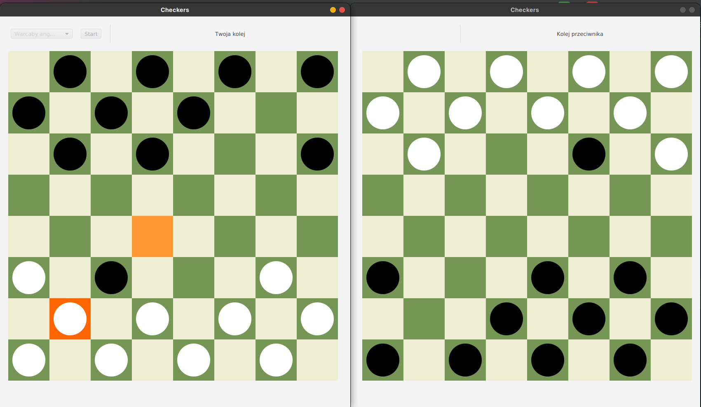

# Checkers
A Java application for playing checkers based on client-server architecture, GUI made with JavaFX.

## Available game types and rules:

1. English checkers:
 - 8x8 board, players move on dark fields
 - Players have 12 pieces.
 - Capturing is obligatory, but only possible in the case of regular pawns in the forward direction. The player has no obligation
capturing the largest possible number of pieces, he can choose any capture.
- The king performs the so-called "short moves" - one square forward or back. A king can hit backwards.
- A pawn becomes a king if it reaches the end line of the board on the opponent's side.
  
2. Italian checkers:
 - 8x8 board, players move on dark fields
 - Players have 12 pieces.
 - Capturing is obligatory, but pawns can only capture forwards. The player has no obligation
capturing the largest possible number of pieces, he can choose any capture.
 - Similarly to English checkers, the king performs the so-called "short moves" and may beat backwards.
   A pawn becomes a king if it reaches the end line of the board on the opponent's side.
 - A special feature of Italian checkers is that an ordinary pawn cannot capture a king.

3. Two-line checkers:
 - 8x8 board, players move on dark fields
 - Players have 8 pieces.
 - Capturing is obligatory, but only possible in the case of regular pawns in the forward direction. The player is not obliged to capture the largest possible number of pieces, he can choose any capture.
 - The king performs the so-called "short moves" - one square forward or back. A king can beat backwards.
 - A pawn becomes a king if it reaches the end line of the board on the opponent's side.

## Authors
Michał Biszczanik, Miłosz Chojecki
